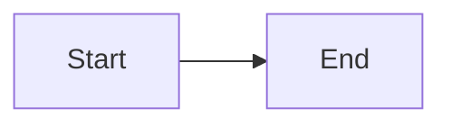

# Topic Name

## Diagram

```mermaid
flowchart LR
    A[Start] --> B[End]
```

## Explained in 5 lines
1.
2.
3.
4.
5.

## Common interview questions
- Q1:
- Q2:
- Q3:

## Revision cheat-line
> One sentence to remember.
